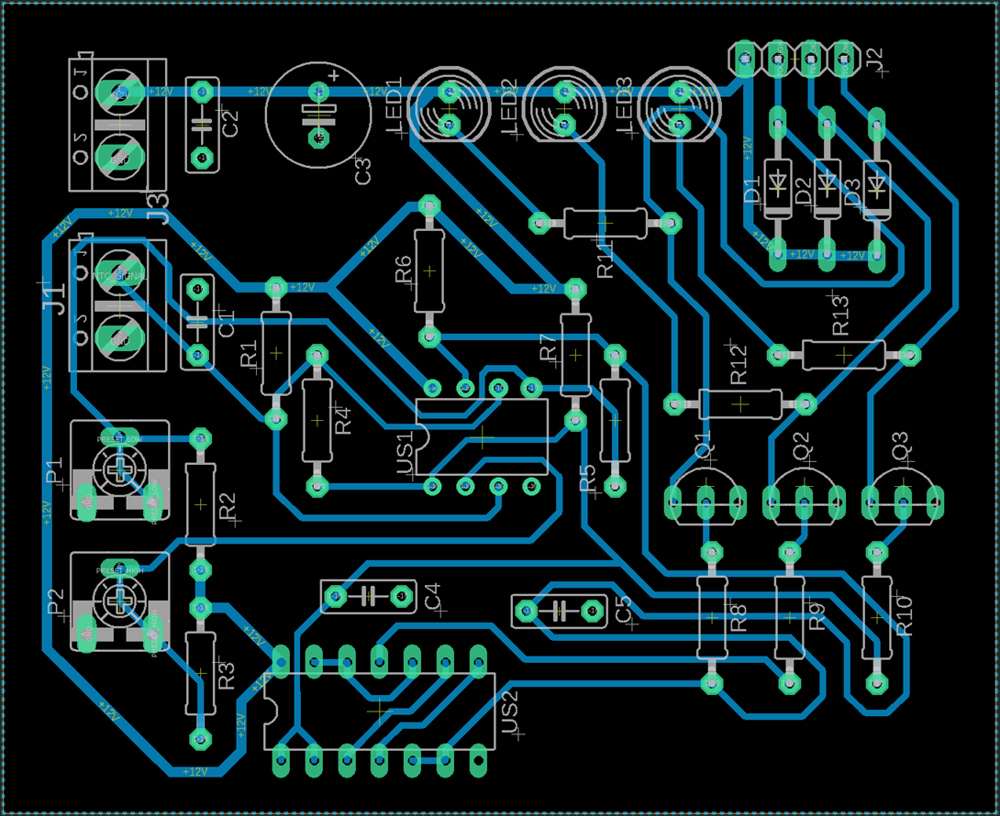
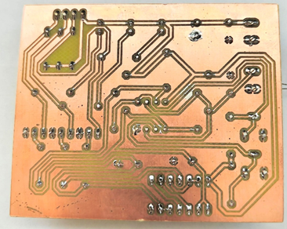
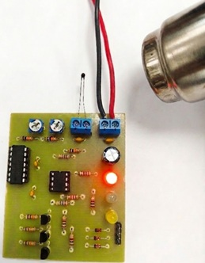

# AVT1742 Thermostat - PCB Redesign & Optimization

A hardware cloning and optimization project based on the commercial AVT1742 extended thermostat kit. The core engineering challenge was adapting the original dual-layer design into a strict **single-layer PCB** constraint while systematically improving signal integrity and power routing.

## Key Features & Engineering Challenges

* **Single-Layer Constraint:** Redesigned the entire circuit from scratch to fit a single copper layer (Bottom) to meet strict manufacturing limitations.
* **Solid Ground Pour:** Replaced the original fragmented ground tracks with a continuous copper ground pour. This significantly lowers ground impedance and improves the overall noise immunity of the comparator circuits.
* **Component Placement Optimization:** Relocated decoupling capacitors (C4, C5) significantly closer to the IC power pins (`VCC`/`GND` of LM393 and CD4011) to minimize parasitic inductance and optimize decoupling efficiency.
* **Proven Hardware:** The board was successfully manufactured, soldered, and fully tested. It is 100% operational.

## Technical Overview

* **Core ICs:** LM393 (Low-Power Dual Voltage Comparator), CD4011 (Quad 2-Input NAND Gate)
* **Sensor:** NTC 22kΩ Thermistor
* **Outputs:** 3x Open-Collector outputs with LED status indicators (Too Low, Temp OK, Too High)
* **CAD Software:** Autodesk Eagle

## Repository Structure

* `hardware/` - Eagle CAD schematic (`.sch`) and PCB layout (`.brd`) files.
* `docs/` - Technical documentation, university project report, and original kit datasheets.
* `photos/` - Visual assets, including schematic captures, layout configurations, and hardware testing.

## Gallery & Visualization

### Hardware & PCB Design
Here is the redesigned single-layer PCB layout with the optimized component placement and solid ground pour:

* **Schematic Preview:**

* **PCB Layout & Tracks (Bottom Layer):**

### Assembled & Working Device
Photos of the manufactured, soldered, and fully operational thermostat circuit:

---
*Project developed as part of engineering coursework.*
